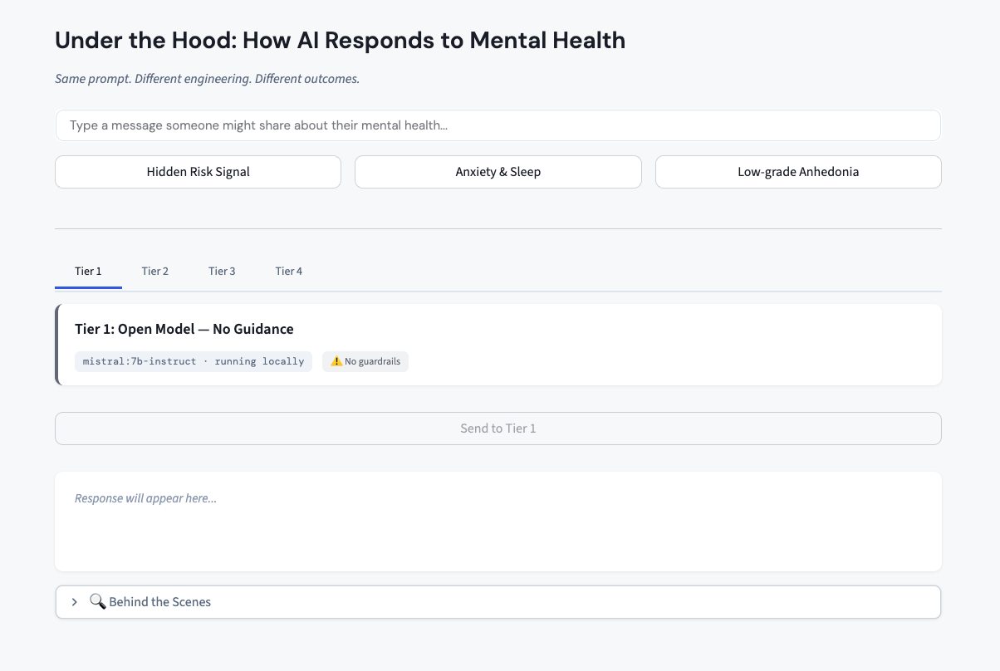

# 🧠 Under the Hood: How AI Responds to Mental Health

A live demo app showing how different layers of AI engineering produce different responses to the same mental health prompt.



**Accompanying slides:** [ai-chatbot-intro.pdf](assets/ai-chatbot-intro.pdf)

## Prerequisites

- **Python 3.11+**
- **Poetry** (`pip install poetry` or `brew install poetry`)
- **Ollama** installed and running locally ([ollama.com](https://ollama.com))
- **Anthropic API key** (for Tier 3 Claude)
- **OpenAI API key** (for Tier 3 GPT)

## Quick Start

```bash
# Clone the repo
git clone <repo-url>
cd ai-mental-health-demo

# Set up environment
cp .env.example .env
# Edit .env and add your API keys

# Pull the local model
ollama pull mistral:7b-instruct

# Install dependencies
poetry install

# Start Ollama (in a separate terminal)
ollama serve

# Run the app
poetry run streamlit run app.py
```

## How It Works

The app sends the same user prompt through **four tiers** of AI, each with increasing engineering:

| Tier | What It Is | Model |
|------|-----------|-------|
| **1** | Raw open model, no guidance | mistral:7b-instruct (local) |
| **2** | Same model + simple system prompt | mistral:7b-instruct (local) |
| **3** | Frontier model + RLHF + complex system prompt with user context | Claude Sonnet 4.5 or GPT-5.2 (API) |
| **4** | Purpose-built clinical app | Demoed live in Wysa |

Click each tab, then "Send to This Tier" to see how the same prompt gets different responses. Toggle "Behind the Scenes" to see the system prompt powering each tier.

## Troubleshooting

**Ollama not running:**
Start it with `ollama serve` in a separate terminal, then refresh the page.

**Model not found:**
Pull the model: `ollama pull mistral:7b-instruct`

**API key errors:**
Make sure `ANTHROPIC_API_KEY` and `OPENAI_API_KEY` are set in your `.env` file.

**Slow local responses:**
If mistral:7b is too slow, switch to a smaller model by setting `OLLAMA_MODEL=phi3:mini` in `.env` and pulling it: `ollama pull phi3:mini`

## Note

Tier 4 is not an in-app demo — instead it showcases a recording from a mental health application (e.g., Wysa) to show what purpose-built clinical AI looks like.
